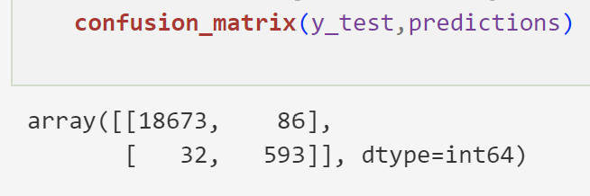
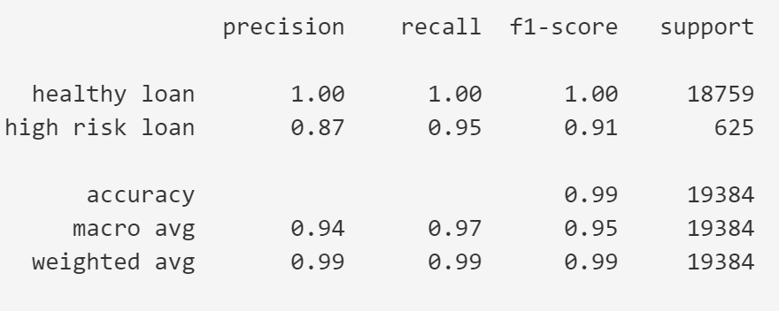

# credit-risk-classification
The purpose here is to develop a model that can accurately predict whether loan applications should be approved as healthy or disapproved as high-risk.  Collected data for developing predictions include: loan size; interest rate; borrower income; borrower total debt; debt-to-income ratio; number of accounts; and derogatory marks, which is not well-defined in the documentation.

The data were imported, and loan status was identified as the target variable.  The target (loan status) data were separated from the features and each of these were split into training and testing datasets.  A logistic regression model was created and fit with the training data.  Predictions were made based upon the testing features and these were compared with the testing targets. 

A confusion matrix and a classification report were generated to examine the results to determine whether the model is appropriate for use in predicting healthy and high-risk loans.  Some of the results are shown below

    Precision for high-risk loans: 87% of loan applications identified as high-risk are actually high-risk.  13% (86 out of 679) of 
    loans identifed as high-risk were not high-risk.  This is the weakest part of the model.

    Recall for high-risk loans: 95% of applications that should be identifed as high-risk were identified correctly with this model.  
    The testing dataset contained 625 high-risk applications, and 593 of these were flagged as high risk by the model.  
    Only 5% (32 out of 625) were not flagged as high risk.

    Precision for healthy loans: Greater than 99.5% of loan applications that are actually good risks are identified by the model 
    as healthy (18,673 out of 18,759).  There were 86 loan applications that should have been identified as healthy that were not.  

    Recall for healthy loans: Greater than 99.8% of loan application that are identified as healthy and likely to be approved were 
    actually healthy (18,673 out of 18,705) .  Only 32 high-risk loan applications out of the 18,705 applications predicted to be 
    good risks slipped by the algorithm.
      

    Accuracy:  The overall accuracy is 99%.  Of the 19,384 loan applications in the testing dataset, 19,266 were correctly classified.

I recommend using this model for identification of healthy and high-risk loans.  The model correctly classifies 99% of the loan applications as either healthy or high-risk.  Of the applications that are not classified correctly, only a very small percentage (0.2%) are high-risk loans that are not identified.  When used for approving or denying loans, this model is more likely to deny healthy loans than it is to approve high-risk loans.  In that sense, it is conservative.  The weakest part of the model is the loss of opportunity to provide loans to some healthy credit-risks.  If the bank wishes to improve upon this, I would suggest more detailed examination of the applications predicted to be high risk.